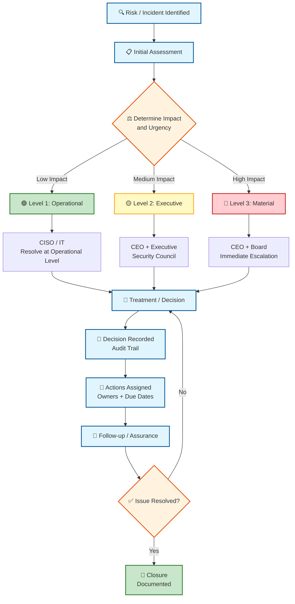

# TechGlobal Governance Transformation Simulation

**International Cybersecurity and Digital Forensics Academy**

## Week 3 Practical Laboratory

### Roles, Responsibilities and Accountability in Security Governance

---

| Field | Details |
|-------|---------|
| **Student Name** | Hilda Odein Joshua-Jack |
| **Reg. No** | C11/26/CGRCE/17247 |
| **Cohort** | Cohort 11 |
| **Week** | Week 3: 19–25 September 2026 |
| **Course** | GRC102 – Information Security Governance |
| **Module** | Module 3 – Roles and Responsibilities in Security Governance |
| **Maximum Score** | 100 marks |
| **Effective Course Contribution** | 10% – Practical Laboratories |
| **Date of Submission** | 25th September, 2026 |

---

## Table of Contents

1. [Executive Summary](#executive-summary)
2. [Evidence Bundle 1: Governance Architecture](#evidence-bundle-1-governance-architecture)
3. [Evidence Bundle 2: Roles and Responsibilities](#evidence-bundle-2-roles-and-responsibilities)
4. [Evidence Bundle 3: Security Governance Committee Ecosystem](#evidence-bundle-3-security-governance-committee-ecosystem)
5. [Evidence Bundle 4: RACI Accountability Matrix](#evidence-bundle-4-raci-accountability-matrix)
6. [Evidence Bundle 5: Cyber-Risk Escalation](#evidence-bundle-5-cyber-risk-escalation)
7. [Evidence Bundle 6: Segregation of Duties and Accountability](#evidence-bundle-6-segregation-of-duties-and-accountability)
8. [Conclusion](#conclusion)
9. [References](#references)
10. [Appendix A: Assessment Checklist](#appendix-a-assessment-checklist)

---

## Executive Summary

TechGlobal has grown to about 2,500 employees across five offices, but its security governance structure has not grown with it. At the moment, many important security decisions are concentrated around the IT Director. There are also no formal security governance committees, business units make some security decisions independently, and the Board does not receive enough information about cyber risk.

The main problem is not simply that IT has too much responsibility. The bigger issue is that security accountability is not clearly shared across the organisation. Cybersecurity affects finance, legal and regulatory obligations, employees, customers, business operations and the organisation's reputation. These areas therefore need to be represented in security decisions.

This report proposes a governance structure where the Board provides oversight, the CEO provides executive accountability, the CISO leads security, the CRO/Risk function provides independent risk oversight, and other functions such as Legal, Finance, HR, IT and Business Units have defined responsibilities.

The proposed model also introduces an Executive Security Council, a Security Governance Committee and a specialist working group. A RACI matrix is used to clarify accountability for important activities, while a cyber-risk escalation process provides a clear route for significant risks to move from operational teams to executive management and, where necessary, the Board.

The aim is to create a governance model that is practical for TechGlobal's size without creating unnecessary bureaucracy.

---

## Evidence Bundle 1: Governance Architecture

### 1.1 Governance Gap Assessment

The current governance model has several weaknesses.

| Current weakness | Business / security consequence |
|-----------------|--------------------------------|
| Security decisions are concentrated with the IT Director | One role has too much control over security decisions, technology operations and risk-related matters. This can create conflicts of interest and weak independent challenge. |
| No formal security governance committee exists | Security issues may be discussed only when problems occur, rather than being reviewed regularly and collectively. |
| Business units make inconsistent security decisions | Different offices or departments may apply different security practices, creating uneven levels of protection. |
| Limited Board visibility | Directors may not have enough information to understand major cyber risks, security investment needs or the organisation's overall risk position. |
| Risk acceptance is not clearly separated from security management | Security and technology teams could end up accepting risks that they are also responsible for managing. |
| There is no clear escalation route | A serious cyber issue could remain at operational level for too long before senior management becomes aware of it. |
| Security accountability is not clearly documented | When something goes wrong, it may be difficult to determine who was responsible for the decision, approval or control. |

**Main observation**

The current structure is heavily IT-centred. This might have worked when TechGlobal was smaller, but it becomes increasingly difficult to manage as the organisation expands across five offices.

Security should therefore be treated as an organisational risk rather than only an IT responsibility.

---

### 1.2 Stakeholder Map

| Stakeholder | Authority / Influence | Primary Interest | Information Needed | Governance Contribution |
|------------|----------------------|-----------------|-------------------|------------------------|
| Board | Very High | Enterprise risk, reputation and regulatory exposure | Major risks, incidents, trends, assurance results | Provides oversight and challenges management |
| CEO | Very High | Business performance and strategic risk | Significant security risks, investment requirements and major incidents | Provides executive accountability |
| CISO | High | Security strategy and programme effectiveness | Security risks, incidents, controls and performance | Leads security governance and advises management |
| CRO / Risk | High | Enterprise risk management | Cyber risk exposure, risk treatment and accepted risks | Provides independent risk challenge and aggregation |
| Legal / Compliance | High | Legal, regulatory and contractual obligations | Incidents, privacy issues, regulatory requirements | Provides legal and regulatory advice |
| Finance | High | Budget and financial exposure | Security investment, losses and financial impact | Supports funding and financial controls |
| HR | Medium | Employee lifecycle and conduct | Joiner/mover/leaver information, awareness and disciplinary matters | Supports people-related security controls |
| IT | High | Technology operations and service availability | Technical risks, vulnerabilities and system issues | Implements and operates technical controls |
| Business Unit Leaders | High within their areas | Business continuity and operational performance | Risks affecting their processes and services | Own business risks and implement controls |

---

### 1.3 Proposed Security Governance Organisation Structure

The proposed structure is:
BOARD OF DIRECTORS
│
Risk / Audit Committee
│
CEO
│
┌──────────────┴──────────────┐
│ │
CISO CRO / RISK
│ │
└──────────────┬──────────────┘
│
Executive Security Council
│
Security Governance Committee
│
┌───────────────┬───────┼────────┬───────────────┐
│ │ │ │ │
IT Legal Finance HR Business Units
│
│
Specialist Security Working Group

The structure creates two important principles.

**First**, the CISO remains responsible for leading security activities, but does not operate as the sole decision-maker for enterprise risk.

**Second**, the CRO/Risk function provides a separate risk perspective. This creates a level of challenge around risk assessment and acceptance rather than leaving all decisions with IT.

---

### 1.4 Consultant Justification

I recommend this structure because TechGlobal is no longer small enough for security decisions to remain mainly within IT. With approximately 2,500 employees and five offices, security decisions can affect several parts of the organisation at the same time.

For example, a security incident may require technical action from IT, legal advice, communication with customers, financial decisions and HR involvement. If all of these decisions are handled informally through IT, important issues can easily be missed.

The proposed model does not mean that every security decision has to go to the Board. Most operational matters should remain with the appropriate teams. The purpose of the governance structure is to make it clear which decisions can be handled operationally and which ones require executive or Board attention.

The Board should focus on oversight rather than day-to-day security operations. The CEO should ensure that security remains aligned with business objectives. The CISO should lead the security programme, while the CRO/Risk function provides independent risk oversight.

The Security Governance Committee provides the main cross-functional forum for discussing security risks, policies, control performance and decisions that require input from different departments.

This should make the model scalable because routine decisions remain at operational level while significant risks have a defined route upwards.

---

## Evidence Bundle 2: Roles and Responsibilities

### 2.1 Governance Responsibility Matrix

| Role | Purpose | Key Responsibilities | Decision Authority | Reports / Escalates To | KPIs / Evidence |
|------|---------|---------------------|-------------------|----------------------|----------------|
| Board | Provide oversight | Review major cyber risks, risk appetite and significant incidents | Approves major risk direction and Board-level matters | CEO / relevant Board committee | Board reports, risk dashboard |
| CEO | Executive accountability | Align security with business strategy, approve major investments | Executive decisions and major risk decisions within delegated authority | Board | Security investment, major risk status |
| CISO | Lead security governance | Security strategy, policies, security programme, reporting and incident governance | Security standards and programme decisions within mandate | CEO / Executive Security Council | Risk trends, incidents, policy compliance |
| CRO / Risk | Independent risk oversight | Risk methodology, challenge, aggregation and monitoring | Risk framework and challenge of risk acceptance | CEO / Board risk committee | Risk register, accepted risks |
| Legal | Legal and regulatory advice | Privacy, contracts, regulatory requirements and notification advice | Legal interpretation and advice | CEO / relevant executive | Regulatory matters, legal reviews |
| Finance | Financial governance | Budget, financial exposure and investment oversight | Budget decisions within delegated authority | CEO / Board | Security spend, financial exposure |
| HR | People governance | Awareness, employee lifecycle, disciplinary processes | HR decisions relating to employees | CEO | Training completion, JML compliance |
| IT | Technology delivery | Technical controls, infrastructure, vulnerabilities and service continuity | Technical implementation within approved standards | CISO / CIO or CEO structure | Patch status, incidents, availability |

---

### 2.2 Role Profiles

#### Board of Directors

The Board provides oversight rather than managing daily security operations.

**Key responsibilities:**
- Review major cyber risks.
- Understand the organisation's cyber risk profile.
- Review significant incidents.
- Challenge management where security risks are not being adequately addressed.
- Ensure appropriate assurance is available.

**Decision authority:** Board-level risk appetite, strategic oversight and matters requiring Board approval.

---

#### CEO

The CEO is responsible for ensuring that cybersecurity is treated as an organisation-wide business issue.

**Key responsibilities:**
- Set executive expectations for security.
- Approve major security investments.
- Resolve significant cross-functional issues.
- Ensure management responds to material risks.
- Escalate appropriate matters to the Board.

**KPIs:** Security investment delivery, material risk treatment and closure of major governance actions.

---

#### CISO

The CISO is the main security governance leader.

**Key responsibilities:**
- Develop the security strategy.
- Maintain security policies and standards.
- Coordinate security risk reporting.
- Monitor control effectiveness.
- Lead security governance forums.
- Coordinate major incident governance.

The CISO should not independently approve acceptance of risks that the CISO is responsible for managing.

---

#### CRO / Risk

The CRO/Risk function provides an independent enterprise risk perspective.

**Key responsibilities:**
- Maintain the risk methodology.
- Challenge risk assessments.
- Monitor accepted risks.
- Aggregate cyber risks into the enterprise risk profile.
- Escalate significant risk concerns.

---

#### Legal / Compliance

Legal provides advice where security matters create legal, contractual or regulatory implications.

This includes data protection, contractual obligations, regulatory notification and preservation of evidence.

---

#### Finance

Finance supports security governance through budgeting and financial oversight.

It should help management understand the financial implications of security risks and investment decisions.

---

#### HR

HR is responsible for the people-related side of security.

This includes employee onboarding, transfers, departures, awareness programmes and disciplinary processes.

---

#### IT

IT implements and operates many of the technical controls.

However, IT should not be the sole owner of security governance. Technical implementation and enterprise risk decisions should remain separate.

---

### 2.3 Conflict Resolution

Three important areas of potential conflict are:

**1. CISO vs CRO/Risk**

The CISO manages security risks while the CRO/Risk function independently challenges those risks.

**Resolution:** The CISO prepares the risk assessment and treatment plan. CRO/Risk reviews and challenges it. Risk acceptance follows the organisation's delegated authority.

**2. CISO vs IT**

IT operates technical systems while the CISO defines security requirements.

**Resolution:** The CISO establishes security requirements and monitors compliance. IT implements and operates the controls.

**3. Business Unit vs CISO**

A Business Unit may want to accept a security exception to meet an operational deadline.

**Resolution:** The Business Unit can request an exception, but acceptance must follow the formal risk acceptance process and appropriate approval level.

---

## Evidence Bundle 3: Security Governance Committee Ecosystem

### 3.1 Committee Structure

#### Executive Security Council

**Purpose:** Strategic oversight.

**Members:**
- CEO
- CISO
- CRO/Risk
- CFO/Finance representative
- Legal representative
- HR representative
- IT leadership
- Selected Business Unit leaders

**Frequency:** Quarterly, with emergency meetings when required.

---

#### Security Governance Committee

**Purpose:** Regular cross-functional security governance.

**Members:**
- CISO – Chair
- CRO/Risk
- IT
- Legal
- Finance
- HR
- Business Unit representatives

**Frequency:** Monthly.

---

#### Security Working Group

I recommend a Cyber Incident and Resilience Working Group.

**Purpose:**
- Review incident readiness.
- Review lessons from incidents.
- Track recovery improvements.
- Coordinate technical and business continuity activities.

**Frequency:** Monthly and additionally after major incidents.

---

### 3.2 Committee Interaction
Business Units / IT / Security Teams
│
▼
Security Working Group
│
▼
Security Governance Committee
│
▼
Executive Security Council
│
▼
CEO
│
▼
Board / Risk Committee

Information should move upwards when the risk is significant, but not every operational issue should reach executive management.

---

### 3.3 Terms of Reference

**Committee Name**

TechGlobal Security Governance Committee

**Purpose**

The committee provides a regular forum for reviewing security risks, policies, control performance, incidents and security-related decisions that require cross-functional input.

**Responsibilities**

- Review cyber-risk trends.
- Review security policies and proposed changes.
- Monitor major security programme activities.
- Review unresolved security issues.
- Review significant third-party risks.
- Monitor security awareness.
- Review incident lessons and corrective actions.
- Recommend matters requiring executive attention.

**Decision-making**

The committee should aim for consensus. Where consensus cannot be reached, the issue should be documented and escalated to the appropriate decision-maker.

**Records**

Minutes, decisions, action owners and due dates should be recorded after each meeting.

---

### 3.4 Sample Meeting Agenda

**TechGlobal Security Governance Committee**

**Date:** 15 October 2026

1. Opening and confirmation of previous minutes
2. Review of outstanding actions
3. Current cyber-risk dashboard
4. Security incidents since previous meeting
5. Vulnerability and remediation status
6. Third-party security risks
7. Security awareness results
8. Policy updates
9. Business Unit security issues
10. Decisions required
11. Matters requiring escalation
12. Any other business
13. Closing

---

### 3.5 Sample Decision Log

| Date | Decision / Issue | Decision Owner | Decision | Rationale | Actions / Owner | Review Date |
|------|-----------------|---------------|----------|-----------|----------------|-------------|
| 15 Oct 2026 | Privileged access review | CISO | Quarterly reviews approved | Privileged accounts require closer monitoring | IT to complete review | 15 Jan 2027 |
| 15 Oct 2026 | Third-party security assessment | CRO/Risk | High-risk vendors require enhanced assessment | Supplier risk needs consistent treatment | Procurement and Security | 30 Nov 2026 |
| 15 Oct 2026 | Security awareness | HR/CISO | Additional phishing awareness campaign approved | Training results show need for improvement | HR and Security | 31 Dec 2026 |

---

### 3.6 12-Month Governance Calendar

| Month | Main Governance Activity |
|-------|-------------------------|
| January | Annual security strategy review |
| February | Enterprise cyber-risk assessment |
| March | Board cyber-risk report |
| April | Policy review |
| May | Third-party risk review |
| June | Mid-year security programme review |
| July | Security awareness review |
| August | Business continuity and recovery exercise |
| September | Vulnerability management review |
| October | Annual access governance review |
| November | Security budget and investment planning |
| December | Annual governance effectiveness review |

Monthly Security Governance Committee meetings and quarterly Executive Security Council meetings continue throughout the year.

---

## Evidence Bundle 4: RACI Accountability Matrix

**Key:**
- **R** = Responsible
- **A** = Accountable
- **C** = Consulted
- **I** = Informed

| Activity | Board | CEO | CISO | CRO/Risk | Legal | Finance | HR | IT | BU |
|----------|-------|-----|------|----------|-------|---------|-----|-----|-----|
| Cybersecurity strategy approval | I | A | R | C | C | C | I | C | C |
| Security policy approval | I | A | R | C | C | I | C | C | C |
| Enterprise cyber-risk assessment | I | I | R | A | C | I | I | C | C |
| Risk acceptance | I | A* | C | R | C | I | I | C | C |
| Security budget approval | A* | A | R | C | I | R | I | C | C |
| Security architecture approval | I | I | A | C | I | I | I | R | C |
| Third-party security review | I | I | A | C | C | C | I | R | R |
| Access governance | I | I | A | C | I | I | C | R | C |
| Incident response governance | I | A | R | C | C | I | C | R | C |
| Material incident escalation | A* | A | R | C | C | I | I | R | I |
| Regulatory notification decision | I | A | C | C | R | I | I | C | I |
| Security awareness programme | I | I | A | C | I | I | R | C | C |
| Vulnerability remediation oversight | I | I | A | C | I | I | I | R | C |
| Business continuity / recovery governance | I | A | C | C | C | C | C | R | R |
| Board cyber-risk reporting | A | I | R | C | C | I | I | C | I |

*Subject to the organisation's delegated authority and risk appetite.

---

### RACI Observations

Three assignments need particular care.

**Risk acceptance:** The CISO should not automatically be the final risk approver for risks arising from security controls that the CISO manages. CRO/Risk should provide independent challenge, while the appropriate executive approves according to the level of risk.

**Security architecture:** IT should be responsible for technical implementation, while the CISO remains accountable for security requirements and governance.

**Regulatory notification:** Legal should lead the legal assessment, but the final decision should follow TechGlobal's established executive authority.

---

### 4.1 RACI Implementation Guide

The RACI matrix should be used before important governance activities begin.

Managers should first identify the activity and check who is Accountable. There should normally be one accountable role. The person responsible for completing the work may be different from the person accountable for the outcome.

The matrix should also be reviewed when responsibilities change, when a new system or process is introduced, and after major incidents.

During incidents, the RACI should be used together with the incident response plan rather than replacing it.

The CISO and CRO/Risk should review the matrix at least annually to identify duplicated responsibilities or gaps.

---

## Evidence Bundle 5: Cyber-Risk Escalation

### 5.1 Major Cyber-Risk Escalation Workflow
## 5.1 Major Cyber-Risk Escalation Workflow

---

### 5.2 Escalation Threshold Table

| Level | Example Trigger | Decision Authority | Required Notification | Target Response |
|-------|----------------|-------------------|----------------------|----------------|
| Level 1 – Operational | Limited security issue with no significant business impact | CISO / IT | Relevant operational teams | Same business day |
| Level 2 – Executive | Significant service disruption, major control failure, repeated high-risk issue or serious third-party exposure | CEO / Executive Security Council | CEO, CISO, CRO/Risk and relevant executives | Within hours |
| Level 3 – Material / Board | Major customer impact, significant regulatory exposure, major data compromise, prolonged critical service disruption or risk exceeding approved appetite | CEO / Board | Board and relevant Board committee | Immediate escalation |

These thresholds should be reviewed periodically because the actual impact of an incident depends on the affected systems, information, customers and regulatory obligations.

---

### 5.3 Decision Recording

Every significant escalation should have a record showing:

- What happened.
- When it was identified.
- Who assessed it.
- The level assigned.
- Key business and security impacts.
- Decision taken.
- Person who approved the decision.
- Actions assigned.
- Due dates.
- Residual risk.
- Closure date.

This creates an audit trail and makes it easier to review whether similar issues should be handled differently in future.

---

## Evidence Bundle 6: Segregation of Duties and Accountability

### 6.1 Weakness Register

| ID | Weakness / Conflict | Risk Created | Roles Involved | Recommended Control | Residual Risk / Review |
|----|-------------------|-------------|---------------|-------------------|----------------------|
| 1 | IT Director controls security decisions and IT operations | Excessive concentration of authority | IT, CISO | Separate security governance from technology operations | Some coordination risk remains; review quarterly |
| 2 | CISO could assess and accept the same security risk | Lack of independent challenge | CISO, CRO/Risk | CRO/Risk reviews and challenges risk acceptance | Low to moderate residual risk |
| 3 | IT implements controls and independently confirms their effectiveness | Weak assurance | IT, CISO, Internal Audit | Independent control testing | Testing capacity may be limited |
| 4 | Business Unit can request and approve its own security exception | Risk may be understated | BU Leader, CISO, CRO/Risk | Formal exception approval based on risk level | Operational pressure may remain |
| 5 | IT can provision privileged access and approve the request | Unauthorised access could go undetected | IT, HR, Business Owner | Separate request, approval and provisioning responsibilities | Emergency access still requires monitoring |

---

### 6.2 Assurance Approach

The governance model should not depend only on policies being approved. Management should also check whether controls are actually working.

The CISO should monitor security performance and control issues. CRO/Risk should provide independent risk challenge. Internal Audit or another independent assurance function should periodically test important controls.

Significant findings should have an owner, target date and documented closure evidence.

---

## Conclusion

TechGlobal's current security governance model is heavily dependent on IT and does not provide enough separation between security management, technology operations and enterprise risk oversight.

The proposed model distributes responsibility across the organisation while keeping decision-making practical. The Board focuses on oversight, the CEO provides executive accountability, the CISO leads security, CRO/Risk provides independent challenge, and functions such as Legal, Finance, HR, IT and Business Units contribute according to their responsibilities.

The proposed committees, RACI matrix and escalation process provide a clearer way of making and recording decisions. The segregation-of-duties controls also reduce the risk of one person or function having too much control over assessment, approval and implementation.

Overall, the purpose of the new model is not to create more meetings. It is to make security responsibilities clearer, ensure important risks reach the right level of management and give the Board better visibility of the organisation's cyber-risk position.

---

## References

International Organization for Standardization. (2022). *ISO/IEC 27001:2022 Information security, cybersecurity and privacy protection — Information security management systems — Requirements.*

National Institute of Standards and Technology. (2024). *The NIST Cybersecurity Framework (CSF) 2.0.* U.S. Department of Commerce.

National Institute of Standards and Technology. (2022). *NIST Special Publication 800-53 Revision 5: Security and privacy controls for information systems and organizations.* U.S. Department of Commerce.

---

## AI Use Declaration

AI tools were used as a support tool during the preparation of this assignment for brainstorming, organising ideas, language refinement and formatting. The governance analysis, application of concepts to the TechGlobal scenario and final recommendations were reviewed and adapted by the student. The student remains responsible for the accuracy, interpretation and final content of the submission.

---

## Appendix A: Assessment Checklist

| # | Assessment Criteria | Completed |
|---|-------------------|-----------|
| 1 | Governance gap assessment identifies weaknesses in current structure | ☑ |
| 2 | Stakeholder map includes authority, interest, information needs and governance contribution | ☑ |
| 3 | Proposed governance organisation structure is clearly presented | ☑ |
| 4 | Consultant justification explains why the structure is appropriate for TechGlobal | ☑ |
| 5 | Governance responsibility matrix covers all key roles | ☑ |
| 6 | Role profiles define purpose, responsibilities, authority and reporting lines | ☑ |
| 7 | Conflict resolution addresses potential areas of tension | ☑ |
| 8 | Committee structure includes Executive Security Council, Security Governance Committee and Working Group | ☑ |
| 9 | Committee interaction flow is clearly documented | ☑ |
| 10 | Terms of Reference include purpose, responsibilities, decision-making and records | ☑ |
| 11 | Sample meeting agenda is realistic and comprehensive | ☑ |
| 12 | Sample decision log demonstrates proper governance recording | ☑ |
| 13 | 12-month governance calendar covers key annual activities | ☑ |
| 14 | RACI matrix covers all key governance activities | ☑ |
| 15 | RACI observations highlight critical accountability assignments | ☑ |
| 16 | RACI implementation guide provides practical guidance | ☑ |
| 17 | Cyber-risk escalation workflow is clearly presented | ☑ |
| 18 | Escalation threshold table defines clear triggers and authorities | ☑ |
| 19 | Decision recording requirements create proper audit trail | ☑ |
| 20 | Weakness register identifies segregation of duties conflicts | ☑ |
| 21 | Assurance approach explains independent verification | ☑ |
| 22 | Conclusion summarises key recommendations | ☑ |
| 23 | References follow academic standards | ☑ |
| 24 | AI Use Declaration is included and complete | ☑ |

---

*End of Document*

*All assessment criteria have been addressed and completed.*

# AI Use Declaration

AI tools were used as a support tool during the preparation of this assignment for brainstorming, organising ideas, language refinement and formatting. The governance analysis, application of concepts to the TechGlobal scenario and final recommendations were reviewed and adapted by the student. The student remains responsible for the accuracy, interpretation and final content of the submission.
